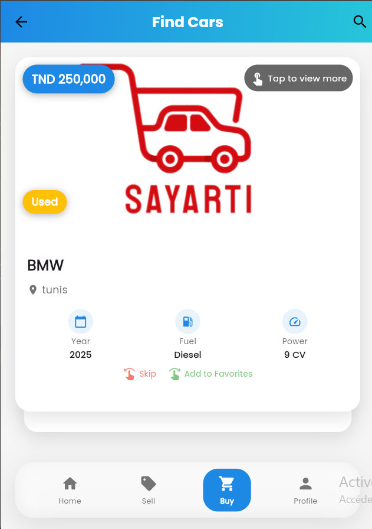

# 🚗 Sayarti - Car Service Application

<div align="center">
  
  
  
  
  
</div>

<div align="center">
  Sayarti is a cutting-edge car service application connecting car owners and buyers through a beautiful, intuitive interface with real-time messaging.
</div>

## 📱 App Showcase

<div align="center">
  <table>
    <tr>
      <td></td>
      <td></td>
      <td></td>
    </tr>
    <tr>
      <td align="center">Login Screen</td>
      <td align="center">Home Screen</td>
      <td align="center">Car Details</td>
    </tr>
    <tr>
      <td></td>
      <td></td>
      <td></td>
    </tr>
    <tr>
      <td align="center">Car Swipe</td>
      <td align="center">Chat</td>
      <td align="center">Profile</td>
    </tr>
  </table>
</div>

## ✨ Features

- **User Authentication** - Secure registration and login system
- **Car Listings** - Browse, add, and manage car listings with detailed information
- **Car Swiping** - Tinder-like interface for discovering cars
- **Favorites** - Save cars to your favorites for later viewing
- **Real-time Chat** - Instant messaging between buyers and sellers
- **User Profiles** - Customizable user profiles with car history
- **Image Upload** - Multiple image uploads for car listings
- **Notifications** - Real-time notifications for new messages and interactions

## 🏗️ Architecture

Sayarti follows a client-server architecture:

### Frontend (Flutter)
- **State Management**: Provider for reactive and efficient UI updates
- **API Communication**: HTTP package for RESTful API calls
- **Local Storage**: Shared Preferences & Secure Storage for user data
- **Real-time Communication**: Socket.IO for instant messaging
- **UI Components**: Material Design with custom widgets and Google Fonts

### Backend (Node.js)
- **API Framework**: Express.js for RESTful endpoints
- **Database**: MySQL for relational data storage
- **Authentication**: JWT (JSON Web Tokens) for secure authentication
- **File Uploads**: Multer for handling multipart/form-data
- **Real-time Server**: Socket.IO for bidirectional communication

## 🚀 Getting Started

### Prerequisites
- Node.js (v14+)
- MySQL (v8+)
- Flutter SDK (3.7.2+)
- Git

### Backend Setup

1. Clone the repository:
   ```bash
   git clone https://github.com/yourusername/sayarti.git
   cd sayarti
   ```

2. Create a MySQL database:
   ```sql
   CREATE DATABASE sayarti_db;
   ```

3. Navigate to the backend directory:
   ```bash
   cd backend
   ```

4. Install dependencies:
   ```bash
   npm install
   ```

5. Create a `.env` file in the backend directory:
   ```
   PORT=5000
   DB_HOST=localhost
   DB_USER=root
   DB_PASSWORD=yourpassword
   DB_NAME=sayarti_db
   JWT_SECRET=sayarti_secret_key_2023
   ```

6. Start the server:
   ```bash
   npm start
   ```

The server will run on port 5000 by default.

### Frontend Setup

1. Navigate to the Flutter app directory:
   ```bash
   cd frontend/sayarti_app
   ```

2. Install dependencies:
   ```bash
   flutter pub get
   ```

3. Run the app:
   ```bash
   flutter run
   ```

## 📡 API Endpoints

### Authentication
- `POST /api/auth/register` - Register a new user
- `POST /api/auth/login` - Login a user

### Users
- `GET /api/users/profile` - Get user profile
- `PUT /api/users/profile` - Update user profile

### Cars
- `GET /api/cars` - Get all cars
- `GET /api/cars/:id` - Get car by ID
- `POST /api/cars` - Create a new car listing
- `PUT /api/cars/:id` - Update a car listing
- `DELETE /api/cars/:id` - Delete a car listing

### Favorites
- `GET /api/favorites` - Get user favorites
- `POST /api/favorites/:carId` - Add car to favorites
- `DELETE /api/favorites/:carId` - Remove car from favorites

### Messages
- `GET /api/messages/conversations` - Get user conversations
- `GET /api/messages/:conversationId` - Get messages in a conversation
- `POST /api/messages` - Send a new message

### Uploads
- `POST /api/upload` - Upload files (images)

## 🔒 Security Features

- Password hashing with bcrypt
- JWT authentication for API protection
- Secure storage for sensitive user data
- Input validation and sanitization
- Protected API routes with middleware

## 📱 Mobile App Features

- Responsive design for all screen sizes
- Offline capability for basic functionality
- Push notifications
- Image caching for faster loading
- Dark/Light theme support
- Multi-language support

## 🧰 Tech Stack

### Frontend
- Flutter
- Provider (State Management)
- Socket.IO Client
- HTTP
- Shared Preferences
- Flutter Secure Storage
- Image Picker
- URL Launcher
- Google Fonts
- Flutter Card Swiper

### Backend
- Node.js
- Express
- MySQL
- Socket.IO
- JWT (jsonwebtoken)
- Bcrypt
- Multer
- CORS
- Dotenv

## 📱 Supported Platforms

- Android
- iOS
- Web (responsive)
- Windows
- macOS
- Linux

## 🔮 Future Enhancements

- AI-powered car recommendations
- In-app payment processing
- Augmented reality car viewing
- Maintenance scheduling and reminders
- Integration with vehicle history services
- Voice search functionality

## 👨‍💻 Author

Developed with ❤️ by [Mohamed Amin Sayari (Kaaboura)](https://github.com/kaaboura12)

## 📄 License

This project is licensed under the MIT License - see the LICENSE file for details. 